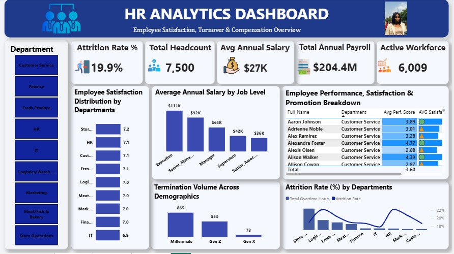
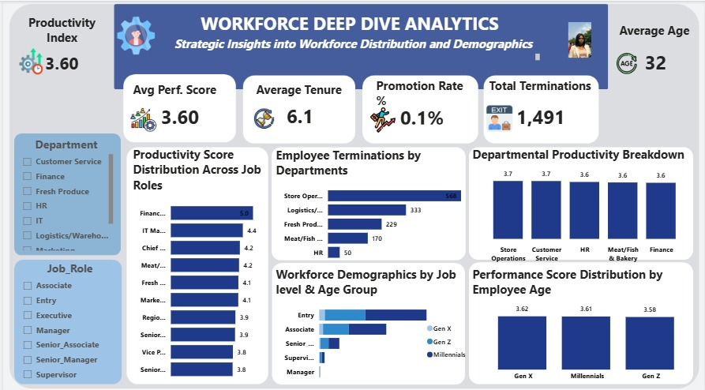

# Hi, I'm Felix 👋

**Data Analyst | Power BI & Excel Specialist**

*Turning raw, messy data into dashboards that tells a clear story.*

Recently completed my data analytics program and currently building 
hands-on projects to demonstrate my data analysis skills. I specialize 
in cleaning and transforming raw data in Excel, then building interactive 
dashboards in Power BI to turn that data into clear, actionable insights.

---

## 🔧 Skills
- **Data Cleaning & Preparation:** Excel (Power Query, formulas, pivot tables)
- **Data Visualization:** Power BI (DAX, interactive dashboards, data modeling)
- **Also working with:** SQL for data querying and cleaning

---

## 📊 Projects

### HR Analytics Dashboard
An interactive two-page Power BI dashboard analyzing employee attrition, 
compensation, and workforce demographics across a 6,000+ person organization. 
Page one tracks attrition rate, headcount, payroll, and satisfaction by 
department; page two drills into productivity, tenure, promotion rate, and 
performance scores by job role and age group.

---

**Key Insights:**
- Millennials accounted for the highest termination volume (865), nearly 
  60% more than Gen Z (553) and over 10x that of Gen X (73)
- Store Operations had the highest departmental terminations (568), more 
  than 4x the next closest driver, Logistics/Warehouse (333)
- Despite carrying the highest termination volume, Store Operations still 
  posted the top productivity score (3.7) — suggesting attrition is 
  likely driven by compensation or role fit rather than performance

*(Live dashboard link coming soon — currently building more projects, 
check back soon!)*

---

## 📫 Let's Connect
- LinkedIn: https://www.linkedin.com/in/ukamaka-felix-4160993ab?utm_source=share_via&utm_content=profile&utm_medium=member_android
- Email: felixpeace1@outlook.com
