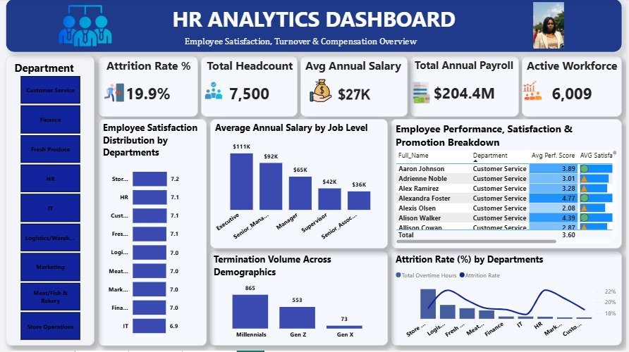
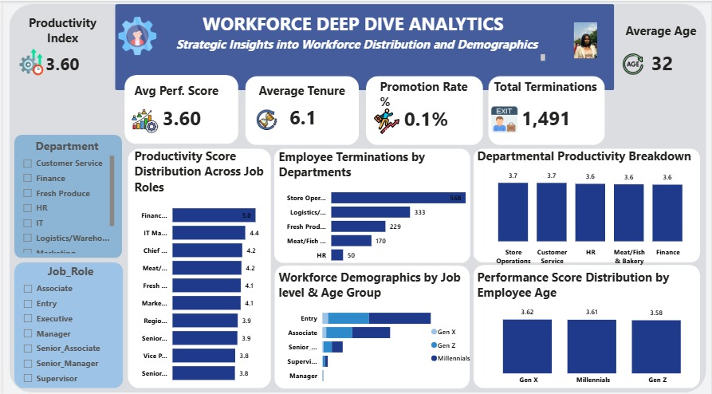

# Hi, I'm Felix 👋

**Data Analyst | Power BI & Excel Specialist**

*Turning raw, messy data into dashboards that tells a clear story.*

Recently completed my data analytics program and currently building 
hands-on projects to demonstrate my data analysis skills. I specialize 
in cleaning and transforming raw data in Excel, then building interactive 
dashboards in Power BI to turn that data into clear, actionable insights.

---

## 🔧 Skills
- **Data Cleaning & Preparation:** Excel (Power Query, formulas, pivot tables)
- **Data Visualization:** Power BI (DAX, interactive dashboards, data modeling)
- **Also working with:** SQL for data querying and cleaning

---

## 📊 Projects

### HR Analytics Dashboard
An interactive two-page Power BI dashboard analyzing employee attrition, 
compensation, and workforce demographics across a 7,500 employees records (6,009 active). 
Page one tracks attrition rate, headcount, payroll, and satisfaction by 
department; page two drills into productivity, tenure, promotion rate, and 
performance scores by job role and age group.

---

## Data Cleaning & Preparation

Source: an Excel workbook with 6 sheets (employees, stores, monthly performance, role KPIs, business outcomes, data dictionary), about 497,000 records.

1.I Reviewed the data dictionary: and profiled each sheet in Power Query (row counts, blanks, data types).
2.Checked for duplicates: none found. All 7,500 Employee_Ids are unique.
3.Checked missing values: the only blanks were Exit_Date (6,009 active employees, blank on purpose) and manager fields for 5 executives who have no manager. No missing values in the stores, monthly performance, role KPI, or business outcome sheets.
4.Checked record coverage: 414 employees who left before 2022 have no monthly performance rows, because the performance data covers 2022 to 2024. I kept them in the headcount and attrition counts and excluded them from performance averages.
5.Converted data types: hire dates, exit dates, and Year_Month were stored as text (dd/mm/yyyy), so I converted them to real dates.
6.Checked consistency: no extra spaces or spelling variants in departments, job roles, or job levels.
7.Validated values: ages (21–64), salaries, performance ratings (1–5), and satisfaction scores (1–10) were all in valid ranges, and no exit date came before a hire date.
8.Verified relationships: every performance record, store ID, and manager ID matches a valid employee or store.
9.Created new fields:
   - Attrition flag from Exit_Date (1,491 exits).
   - Generation group from age: Gen Z (29 and under), Millennials (30–45), Gen X (46 and over).
   - Tenure in years, measured to the exit date for leavers and till today for active staff (average 6.1 years).
10.Built the data model in Power BI, linked on Employee_Id and Store_Id, with DAX measures for attrition rate, headcount, active workforce, average salary, total payroll, promotion rate, and productivity.
11.Reconciled the totals: 7,500 employees = 6,009 active + 1,491 exits, giving 19.9% attrition. Total payroll of $204.4M matches the sum of base salaries.

## Tools: Excel, Power Query, Power BI, DAX

---

## Key Insights:
- Millennials accounted for the highest termination volume (865), nearly 
  60% more than Gen Z (553) and over 10x that of Gen X (73)
- Store Operations had the highest departmental terminations (568), more 
  than 4x the next closest driver, Logistics/Warehouse (333)
- Despite carrying the highest termination volume, Store Operations still 
  posted the top productivity score (3.7) — suggesting attrition is 
  likely driven by compensation or role fit rather than performance

## See more of my work in My portfolio: https://felix-ukamaka-peace.lovable.app

---

## 📫 Let's Connect
- LinkedIn: https://www.linkedin.com/in/ukamaka-felix-4160993ab?utm_source=share_via&utm_content=profile&utm_medium=member_android
- Email: felixpeace1@outlook.com
